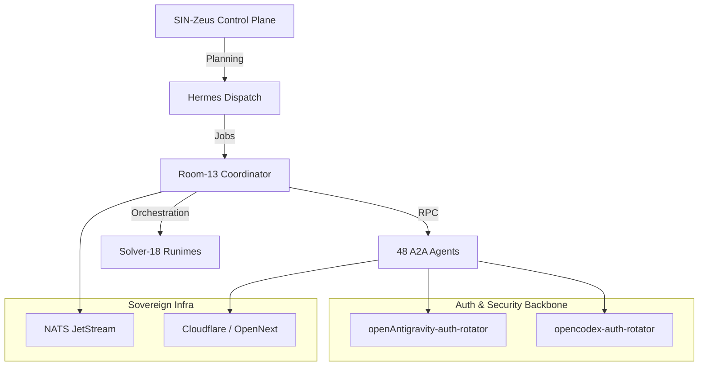

# SIN-Solver System Architecture Overview

**Audience:** Architects & Engineers  
**Prerequisites:** None  
**Last Updated:** 2026-03-21

The SIN-Solver platform is a multi-agent A2A execution environment with strict governance, multi-modal perception, sovereign infrastructure, and continuous enterprise synchronization.

## 1. High-Level Topology

## 2. Core Components

### 2.1 The Control Plane (`sin-solver-control-plane`)
The governance pipeline enforcing the `fleet-metadata` SSOT. It evaluates all 48 agents across 11 teams and drives automated artifact projection (e.g., GitHub Issue boards, Google Docs parity).

### 2.2 Auth Rotators (`openAntigravity` & `opencodex`)
Ephemeral background services that automate browser logins (Chrome CDP / nodriver) to provide real OAuth refresh tokens for the platform models (Gemini, Claude, OpenAI) without human intervention. They are guarded by 3x exponential backoff and Telegram alerting.

### 2.3 The Runtimes
- **Room-13**: The central Python FastAPI coordinator handling ingress and routing.
- **Solver-18**: Node.js workers executing browser/headless automation.
- **dashboard-enterprise**: The public Vercel frontend for operator visibility.

## 3. Data Flows

1. **Governance Flow**: `fleet-metadata.yaml` (SSOT) → `govern eval` → `.sin/agent.yaml` (Projection) → Runtimes.
2. **Auth Flow**: `supervisor.py` → Ephemeral Workspace Account → Nodriver → OAuth Consent → Local Token Store → Cleanup.
3. **Execution Flow**: Hermes Intake → Room-13 Task → JetStream Queue → A2A Agent.

## 4. Key Decisions
See the `ADRs/` directory for historical context on:
- ADR-001: Fleet-Metadata SSOT
- ADR-002: Projection Pipeline
- ADR-003: Ephemeral Rotator
- ADR-006: Google Docs Enterprise Renderer
